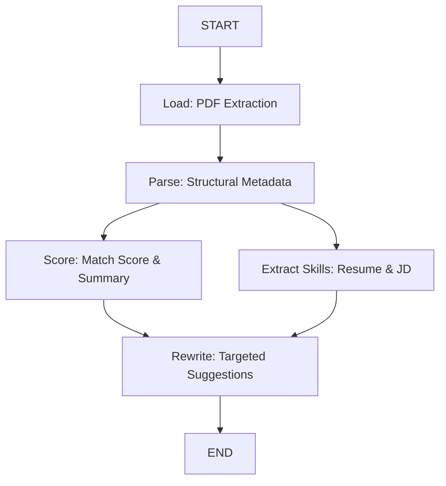

# Resume JD Matcher


An AI-powered ATS (Applicant Tracking System) application that matches resumes against job descriptions (JDs) using a hybrid local-cloud LLM architecture. It provides deterministic, ATS-grade evaluation by leveraging LangGraph to orchestrate a complex evaluation state machine, exposed through a high-throughput FastAPI backend and a Streamlit UI.

## Problem Statement

Traditional ATS parsers often fail to accurately extract semantic meaning from complex resume layouts (like two-column grids) and struggle to provide nuanced, context-aware matching against job descriptions. This project solves this by using spatial-coordinate PDF extraction to preserve semantic boundaries, and a concurrent LLM pipeline to provide highly accurate ATS scores, skill overlap analysis, and targeted resume rewrite suggestions.

## Dataset

*Dataset details are not explicitly provided in the codebase. The system operates dynamically on user-provided PDF resumes and text-based Job Descriptions.*

## Methodology

The application utilizes a distributed, multi-agent directed acyclic graph (DAG) orchestrated via LangGraph. 

1. **Load**: A custom `pdfplumber` engine extracts PDF text using y-axis proximity heuristics to preserve spatial boundaries.
2. **Parse**: A local LLM parses the text to infer structural metadata (layout type, tables, bullets).
3. **Parallel Execution**:
   - **Score Node**: A cloud LLM computes the ATS match score and generates a summary.
   - **Extract Skills Node**: A local LLM extracts relevant skills from the resume and JD.
4. **Rewrite (Fan-in)**: A cloud LLM aggregates the skills and score to generate targeted resume rewrite suggestions.



## Model Details

The system employs a multi-model hybrid architecture with fallback capabilities:
- **Cloud Models (OpenRouter)**: `nvidia/nemotron-3-ultra-550b-a55b:free`
- **Cloud/Remote Ollama**: `gemma4:31b`
- **Local Ollama**: `gemma3:4b` (Primary for parsing and skill extraction)
- **Embeddings**: `sentence-transformers/all-mpnet-base-v2` (384 dimensions)
- **Reranker**: `BAAI/bge-reranker-v2-m3`

## Results

*Results not provided.*

## Project Structure

```text
resume_jd_matcher/
├── app/
│   ├── api/
│   │   └── matcher.py      # FastAPI endpoints
│   └── main.py             # FastAPI application setup
├── configs/
│   └── core_config.py      # Application configuration 
├── data/
│   └── vector_db/          # Vector database storage
├── logs/                   # Application and LLM logs
├── pages/
│   └── resume_matcher.py   # Streamlit sub-page
├── schemas/
│   ├── parse_resume.py     # Pydantic schemas for LLM metadata
│   └── responses.py        # Pydantic schemas for API responses
├── src/
│   ├── ingestion/
│   │   ├── loader.py       # pdfplumber spatial extraction
│   │   └── parser.py       # Structural parsing LLM integration
│   ├── llm/
│   │   ├── prompts.py      # System prompts and instructions
│   │   └── providers.py    # Robust LLM provider interfaces with fallbacks
│   ├── pipeline/
│   │   ├── state.py        # LangGraph state definitions
│   │   └── workflow.py     # LangGraph DAG compilation and execution
│   └── utils/
│       ├── exception.py    # Custom application exceptions
│       └── logger.py       # Logging configuration
├── .env                    # Environment variables
├── pyproject.toml          # Project dependencies
├── requirements.txt        # Python dependencies
└── streamlit_app.py        # Streamlit entry point
```

## Installation and Setup

1. **Clone the repository**:
   ```bash
   git clone <repository_url>
   cd resume_jd_matcher
   ```

2. **Install dependencies**:
   Ensure you have Python >= 3.11.9 installed.
   ```bash
   pip install -r requirements.txt
   ```

3. **Environment Variables**:
   Create a `.env` file in the root directory based on the following template (populate with your actual keys):
   ```env
   # LLM Providers
   OPENROUTER_PROVIDER_NAME='openrouter'
   OPENROUTER_MODEL_NAME='nvidia/nemotron-3-ultra-550b-a55b:free'
   OPENROUTER_API_KEY=''
   
   OLLAMA_PROVIDER_NAME='ollama'
   OLLAMA_MODEL_NAME='gemma4:31b'
   OLLAMA_API_KEY=''
   
   OLLAMA_LOCAL_PROVIDER_NAME='ollama local'
   OLLAMA_LOCAL_MODEL_NAME='gemma3:4b'
   
   # Embeddings
   HUGGINGFACEHUB_API_TOKEN=''
   EMBEDDING_MODEL='sentence-transformers/all-mpnet-base-v2'
   EMBEDDING_DIMENSION=384
   RERANKER_MODEL='BAAI/bge-reranker-v2-m3'
   
   # App Config
   APP_NAME='Resume JD Matcher'
   APP_VERSION='1.0.0'
   VECTOR_DB_PATH='data/vector_db'
   SECRET_KEY=''
   
   # LangSmith Tracing
   LANGCHAIN_TRACING_V2=true
   LANGCHAIN_ENDPOINT='https://api.smith.langchain.com'
   LANGCHAIN_API_KEY=''
   LANGCHAIN_PROJECT='job description matcher'
   ```

4. **Start Local Ollama**:
   Ensure you have Ollama installed and the local models downloaded.
   ```bash
   ollama serve
   ollama run gemma3:4b
   ```

## Usage Examples

You need to run both the FastAPI backend and the Streamlit frontend.

1. **Start the FastAPI Backend**:
   ```bash
   uvicorn app.main:app --host 127.0.0.1 --port 8000
   ```

2. **Start the Streamlit UI** (in a new terminal):
   ```bash
   streamlit run streamlit_app.py
   ```

3. **Interact**:
   Open the Streamlit URL provided in the terminal (usually `http://localhost:8501`). Navigate to the "Resume Matcher" page from the sidebar, upload a PDF resume, paste the Job Description, and view the AI-generated ATS analysis and rewrite suggestions.

## Future Work

Based on the current architecture, future work may include:
- Implementing the matching scoring algorithm explicitly (`match_score = 0.5 * skill_overlap + 0.3 * semantic_similarity + 0.2 * experience_alignment`).
- Integrating the vector database (`data/vector_db`) for RAG-based historical resume/JD semantic search.
- Refining the PDF parsing heuristics for highly unconventional resume formats.

## Tech Stack

- **Backend**: FastAPI, Uvicorn, Python 3.11+
- **Frontend**: Streamlit
- **AI / ML**: LangGraph, LangChain, Ollama, OpenRouter, sentence-transformers
- **Data Parsing**: pdfplumber, Pydantic
- **Observability**: LangSmith
